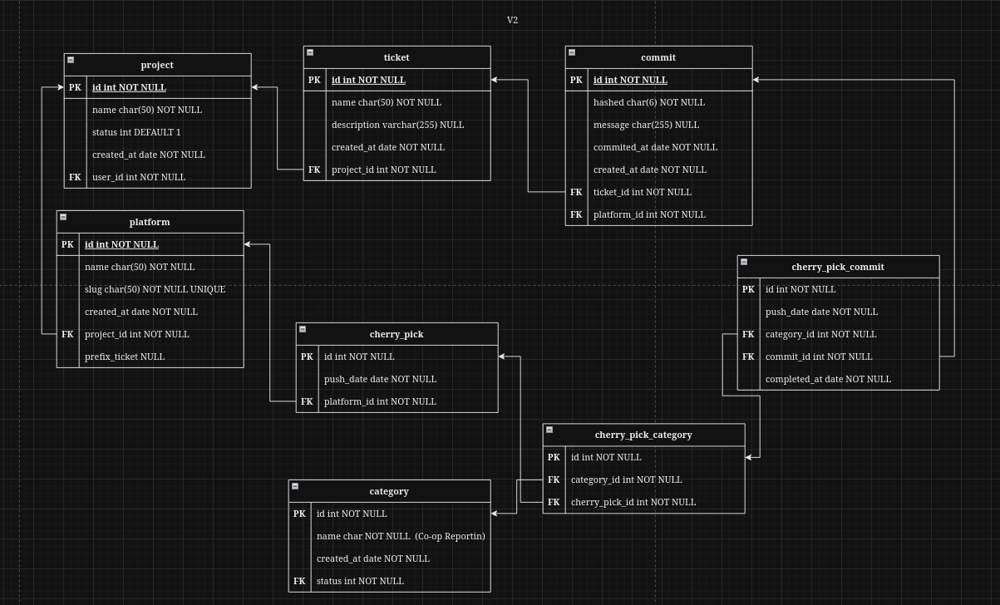

# Git Tracker

Personal project: probably use on my work to improve my management for my tickets and commits on my daily work.

## Stack
- SST
- SolidJs
- Kysely
- Sqlite (Turso)

## Diagram

probably added some statuses on each table but it depends.

## Idea pages

## Roadmap

- [X] Authentication with Github.
    - [ ] :bug: Issue after logged in and tries to redirect on your project it does not show the page. (Failed Temporary Solution: Instead redirecting to recent project. just list the project and let the user click the project.)
- [X] User can view the project details (platforms, production prep tickets).
- [X] User can view list of commits.
- [X] User can create/update commit.
- [ ] User can add production prep tickets commits.
    - [ ] When commits has successfully merged; Add the assign platform on the commit.
- [ ] User can assign the ticket on category.
- [ ] User can view the list of tickets by category.
